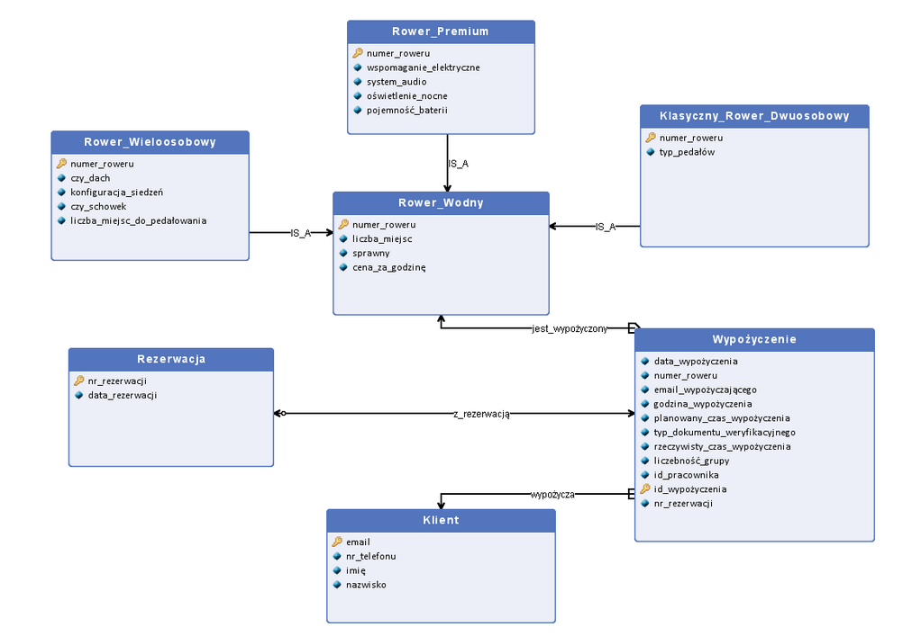

HD order generowania

0. pracownicy -> nie ma znaczenia kiedy
1. Klienci
2. Rowery
3. wypożyczenia z rezerwacją
4. normalne wypożyczenia
5. usterki

faker docs:
- (https://faker.readthedocs.io/en/master/) - general
- https://faker.readthedocs.io/en/stable/providers.html - list of providers

## ERD

- klient musi mieć inny klucz główny

## Excel sheets 

    Arkusz 1 -> Dane o uszkodzeniach rowerów
        Kolumna A -> numer_roweru(id liczbowe)
        Kolumna B -> data_ostatniego_wypożyczenia(data)
        Kolumna C -> data_usterki(data)
        Kolumna D ->nr_telefonu_odpowiedzialnego_klienta(int-9)
        Kolumna E -> przewidywany_koszt_naprawy(float)
        Kolumna F -> wartość_odszkodowania(float)
        Kolumna G -> opis_usterki(tekst)

    Arkusz 2 -> Pracownicy
        Kolumna A -> identyfikator_pracownika(id liczbowe)
        Kolumna B -> PESEL(tekst)
        Kolumna C -> data_zatrudnienia(data)
        Kolumna D -> data_urodzenia(date)
        Kolumna E -> stanowisko(tekst)
        Kolumna F -> stawka_godzinowa(float)

    dodać imie i nazwisko do pracowników
    
